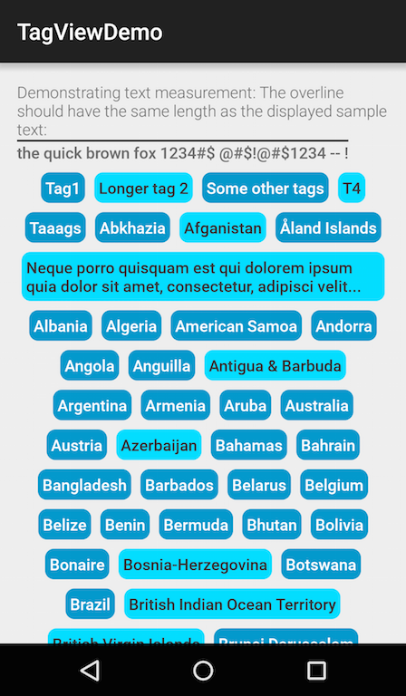

# AndroidTagLayout
A custom view that nicely displays a list of selectable tags.

# Usage

Add the library as a dependency in your module's `build.gradle`:

    dependencies {
      ...
      compile 'com.flavpopescu:taglayout:0.0.2'
    }
    
Make sure you have `jcenter()` added as a maven repo in your project's `build.gradle` (newer Android Studio version already include this by default):

    repositories {
        jcenter()
    }

**Note**: The library may still not be found in `jcenter` as it syncs. If so, please add the following to your repositories:

    maven { url 'https://dl.bintray.com/flavp/maven/'}

